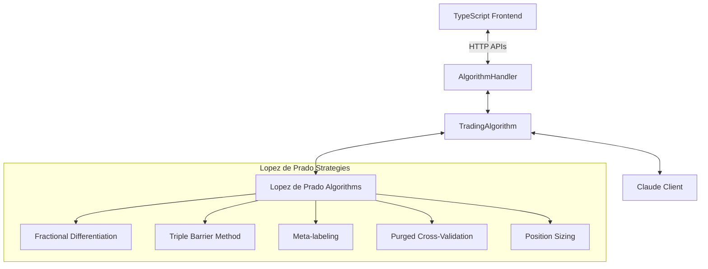

# Lopez de Prado Algorithm Implementation and Integration

## Overview

This document outlines the implementation of key algorithms from Marcos Lopez de Prado's book "Advances in Financial Machine Learning" into the go-trader system. The implementations are designed to integrate with the existing orchestration between the TypeScript frontend and the Go backend.

## Implemented Algorithms

We have successfully implemented five key strategies:

1. **Fractional Differentiation** (`algorithm/algo/fractional_diff.go`)
   - Makes time series stationary while preserving memory
   - Offers both fixed-width window and FFD (Fast Fractional Differencing) methods
   - Includes tools to find optimal differencing parameter

2. **Triple-Barrier Method** (`algorithm/algo/triple_barrier.go`)
   - Implements realistic profit-taking, stop-loss, and time horizons for trade labeling
   - Provides functionality to generate labels for supervised learning
   - Includes utilities for volatility estimation and barrier application

3. **Meta-labeling** (`algorithm/algo/meta_labeling.go`)
   - Creates a secondary model to filter primary trading signals
   - Extracts features from price, volume, volatility, and technical indicators
   - Implements confidence-based filtering mechanism for trade execution

4. **Purged Cross-Validation** (`algorithm/algo/purged_cv.go`)
   - Prevents information leakage in machine learning model validation
   - Implements both standard K-fold and walk-forward validation approaches
   - Adds embargo feature to prevent near-boundary information leakage

5. **Advanced Position Sizing** (`algorithm/algo/position_sizing.go`)
   - Implements Kelly Criterion with fractional sizing
   - Provides volatility-adjusted position sizing
   - Offers portfolio-level diversification approaches

## Integration with Existing Architecture

These algorithms should be integrated with the existing go-trader architecture, which consists of:

1. **TradingAlgorithm** (`algorithm/algorithm.go`) - Main backend orchestrator
2. **AlgorithmHandler** (`algorithm/algorithm_handler.go`) - HTTP API layer
3. **Claude Integration** - AI-based signal generation through `ClaudeClientInterface`

The integration workflow is as follows:



## Integration Points

### 1. Data Preprocessing Phase

Before sending market data to Claude or making trading decisions:

```go
// Example integration in TradingAlgorithm.ProcessSymbol

// Create and configure fractional differencing algorithm
fracDiffAlg, err := algo.Create(algo.AlgorithmTypeFractionalDiff)
if err != nil {
    return fmt.Errorf("failed to create fractional diff algorithm: %w", err)
}

// Configure with appropriate parameters
fracDiffAlg.Configure(algo.AlgorithmConfig{
    AdditionalParams: map[string]float64{
        "d_value": 0.4,               // Differencing parameter, typically 0.3-0.5
        "threshold": 1e-4,            // For FFD method
        "window_size": 20,            // For fixed-width method
    },
})

// Process historical data with fractional differencing
historicalData := getHistoricalDataForSymbol(symbol)
fracDiffResult, err := fracDiffAlg.Process(symbol, currentData, historicalData)
if err != nil {
    return fmt.Errorf("failed to apply fractional differencing: %w", err)
}

// The fractionally differenced data can now be used for signal generation
```

### 2. Signal Generation Phase

When generating trading signals (alongside or as enhancement to Claude's AI predictions):

```go
// Create and configure Triple Barrier algorithm
tbAlg, err := algo.Create(algo.AlgorithmTypeTripleBarrier)
if err != nil {
    return fmt.Errorf("failed to create triple barrier algorithm: %w", err)
}

// Configure Triple Barrier with appropriate parameters
tbAlg.Configure(algo.AlgorithmConfig{
    AdditionalParams: map[string]float64{
        "profit_taking": 2.0,        // Multiple of volatility for profit target
        "stop_loss": 1.0,            // Multiple of volatility for stop loss
        "time_horizon": 5,           // Days for time barrier
        "volatility_lookback": 20,   // Lookback window for volatility estimation
    },
})

// Generate signal using Triple Barrier
tbResult, err := tbAlg.Process(symbol, currentData, historicalData)
if err != nil {
    return fmt.Errorf("failed to apply triple barrier: %w", err)
}

// Apply meta-labeling to filter the signal
metaAlg, err := algo.Create(algo.AlgorithmTypeMetaLabeling)
if err != nil {
    return fmt.Errorf("failed to create meta-labeling algorithm: %w", err)
}

metaAlg.Configure(algo.AlgorithmConfig{
    AdditionalParams: map[string]float64{
        "confidence_threshold": 0.6,  // Minimum confidence to execute trade
        "use_price_features": 1.0,    // Enable price-based features
        "use_volume_features": 1.0,   // Enable volume-based features
    },
})

// Apply meta-labeling to filter signal
metaResult, err := metaAlg.Process(symbol, currentData, historicalData)
if err != nil {
    return fmt.Errorf("failed to apply meta-labeling: %w", err)
}

// The meta-labeled signal can now be used for trade execution
```

### 3. Position Sizing Phase

When executing trades, replace the existing position sizing with the advanced approach:

```go
// Replace the existing calculatePositionSize method with:

// Create position sizing algorithm
posAlg, err := algo.Create(algo.AlgorithmTypePositionSizing)
if err != nil {
    return fmt.Errorf("failed to create position sizing algorithm: %w", err)
}

// Configure with risk parameters
posAlg.Configure(algo.AlgorithmConfig{
    AdditionalParams: map[string]float64{
        "max_size": 0.2,             // Maximum position size as % of capital
        "risk_fraction": 0.3,        // Kelly fraction
        "use_vol_adjustment": 1.0,   // Enable volatility adjustment
        "max_drawdown": 0.1,         // Maximum acceptable drawdown
    },
})

// Calculate optimal position size
posResult, err := posAlg.Process(symbol, currentData, historicalData)
if err != nil {
    return fmt.Errorf("failed to calculate position size: %w", err)
}

// Use the position sizing result to determine trade quantity
```

## API Extensions

To fully support these new algorithms, consider adding the following API endpoints to `AlgorithmHandler`:

1. **Algorithm Configuration**
   - `POST /api/algorithm/config` - Update algorithm configurations

2. **Backtesting**
   - `POST /api/algorithm/backtest` - Run backtests with purged cross-validation

3. **Signal Analysis**
   - `GET /api/algorithm/signals/meta` - Get meta-labeled signals
   - `GET /api/algorithm/signals/barriers` - Get triple-barrier analyzed signals

## Frontend Integration

The TypeScript frontend should be updated to:

1. Display configuration options for the Lopez de Prado algorithms
2. Visualize the results of the algorithms (e.g., barrier events, meta-labels)
3. Show the position sizing recommendations

## Next Steps

1. Create a comprehensive backtesting framework that uses Purged Cross-Validation
2. Implement an orchestration layer that combines all algorithms in a pipeline
3. Update the frontend to visualize the new insights from these algorithms
4. Fine-tune the algorithm parameters based on real-world performance

These algorithms provide a solid foundation for applying Lopez de Prado's advanced quantitative techniques in the go-trader system.

## Frontend Integration

The frontend can access these algorithms through the existing API endpoints:

1. **Algorithm Selection and Configuration**

The frontend should provide a dropdown or selection interface for users to choose which Lopez de Prado algorithm they want to use. Each algorithm will need its own configuration panel with form fields for the parameters described above.

2. **API Workflow**

When a user selects and configures an algorithm, the frontend should:

```javascript
// Example frontend code (React/TypeScript)

// 1. Get algorithm metadata (on page load)
const getAlgorithmMetadata = async () => {
  const response = await fetch('/api/algorithm/analyze?metadata=true');
  const metadata = await response.json();
  return metadata;
};

// 2. Configure an algorithm with user parameters
const configureAlgorithm = async (algorithmType, parameters) => {
  // Using existing analyze endpoint with additional params
  const response = await fetch(`/api/algorithm/analyze?algorithm=${algorithmType}&configure=true`, {
    method: 'POST',
    headers: { 'Content-Type': 'application/json' },
    body: JSON.stringify({ parameters })
  });
  return await response.json();
};

// 3. Execute the algorithm for a specific symbol
const executeAlgorithm = async (algorithmType, symbol) => {
  // Using existing analyze endpoint
  const response = await fetch(`/api/algorithm/analyze?symbol=${symbol}&algorithm=${algorithmType}`);
  const result = await response.json();
  return result;
};
```

3. **Updated Algorithm Analysis Workflow**

The existing `/api/algorithm/analyze` endpoint can be extended to support our new algorithms:

```
GET /api/algorithm/analyze?symbol=AAPL&algorithm=fractional_diff
```

This would return analysis from the fractional differentiation algorithm for AAPL.

4. **UI Components**

The frontend should add:

- Algorithm selection dropdown in the Trade view
- Dynamic configuration panel that changes based on selected algorithm
- Results visualization (charts/tables) for algorithm outputs
- Option to apply the algorithm results to trading decisions

5. **Example UI Workflow**

```
1. User navigates to Trade section
2. User selects "Advanced Algorithms" tab
3. User chooses "Triple Barrier Method" from dropdown
4. UI displays configuration panel with profit-taking, stop-loss and time horizon inputs
5. User sets values and clicks "Analyze"
6. System processes data with Triple Barrier algorithm
7. UI displays results with visualization of profit-taking and stop-loss levels
8. User can click "Apply to Trading" to use these levels for automated trading
```

By leveraging the existing API structure, these algorithms can be seamlessly integrated into the frontend without requiring major backend changes.