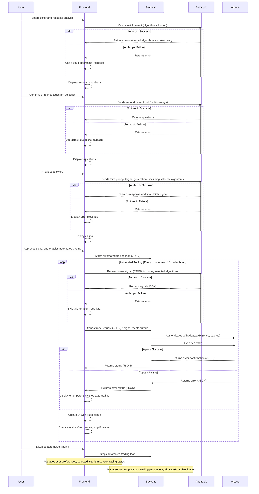

# Technical Requirements Document (TRD)
# Algorithmic Trading System with AI Integration

## 1. Overview

This document outlines the technical requirements for developing an algorithmic trading system that uses AI-based decision making (Claude Sonnet) to determine optimal trade execution strategies. The system will interface with the Alpaca API for market data and trade execution, and will include both frontend and backend components.  The frontend will be the primary point of interaction with the AI, using the Anthropic TypeScript SDK.

## 2. System Architecture

The system follows a client-server architecture, with the frontend handling user interaction and AI integration, and the backend managing trade execution and market data:

1.  **Backend Server**: A Go-based server that:
    *   Interfaces with the Alpaca API
    *   Connects to Alpaca WebSocket streams
    *   Manages ticker symbols
    *   Implements trading algorithms
    *   Executes trades based on signals received from the frontend
    *   Tracks positions

2.  **Frontend**: A web-based UI that:
    *   Integrates with the Anthropic Claude SDK for AI interactions
    *   Displays real-time market data
    *   Shows account information and positions
    *   Provides interfaces for ticker selection, algorithm selection, and trading parameter configuration
    *   Visualizes trading signals and execution status

## 3. Detailed Technical Requirements

### 3.1 Alpaca API Integration

#### 3.1.1 Authentication

*   Store API keys securely (environment variables)
*   Implement API authentication for REST and WebSocket endpoints
*   Handle token renewal and session management

#### 3.1.2 Market Data

*   Connect to Alpaca's market data API
*   Subscribe to real-time price updates
*   Process historical data for analysis

#### 3.1.3 Trade Execution

*   Support market and limit orders
*   Implement position management
*   Handle order status updates

### 3.2 WebSocket Implementation

#### Alpaca WebSocket Client

*   Connect to \`wss://paper-api.alpaca.markets/stream\` or \`wss://api.alpaca.markets/stream\`
*   Implement authentication via WebSocket message: \`{"action": "auth", "key": "{API_KEY}", "secret": "{API_SECRET}"}\`
*   Subscribe to streams via message: \`{"action": "listen", "data": {"streams": ["trade_updates"]}}\`
*   Parse incoming messages from subscribed streams
*   Handle connection errors and implement reconnection logic

### 3.3 Claude AI Integration

#### 3.3.1 API Integration

*   Set up communication with Claude Sonnet
*   Design prompt templates for trading decisions
*   Implement result parsing
*   Use the Anthropic TypeScript SDK (\`@anthropic-ai/sdk\`) for all interactions with Claude.

#### 3.3.2 Decision Making

*   Implement a multi-stage prompting process:
    1.  **Algorithm Selection:** Prompt Claude to recommend appropriate algorithms from "Advances in Financial Machine Learning" by Marcos López de Prado, given the current market data and trading goals. Claude should explain its reasoning.
    2.  **User Preference Elicitation:** Prompt Claude to ask the user clarifying questions about their risk tolerance, profit targets, and preferred trading strategy (take profits or reinvest).
    3.  **Signal Generation:** Prompt Claude to generate a trading signal (buy/sell/hold, order type, limit price, reasoning) based on the selected algorithms, user preferences, and market data.
*   Request responses from Claude in JSON format for easy parsing.
*   Extract buying/selling signals, order type, limit price (if applicable), and reasoning from Claude's JSON responses.
*   Apply risk management rules based on user-provided parameters.

### 3.4 Trading Algorithm

The trading algorithm will be implemented in the Go backend and will be responsible for executing trades based on signals received from the frontend. It will be designed to be modular, allowing for different algorithms to be used based on Claude's recommendations.

The system will use common algorithms from "Advances in Financial Machine Learning" by Marcos López de Prado. The AI will determine which algorithms are most appropriate for a given situation.

#### 3.4.1 Signal Processing

*   Process signals received from the frontend (in JSON format).
*   Validate the received signals.
*   Implement trading rules and constraints
*   Apply position sizing logic

#### 3.4.2 Order Management

*   Generate order parameters
*   Track open orders and positions
*   Implement risk management
*   Implement automated trading logic, including:
    *   Taking profits based on user-defined targets.
    *   Reinvesting profits based on user preference.

### 3.5 Frontend UI

#### 3.5.1 Real-time Data Display

*   Show current ticker prices
*   Display trade signals and recommendations
*   Visualize account and position information
*   Display Claude's "thinking process" (streaming responses).

#### 3.5.2 User Controls

*   Allow ticker symbols selection
*   Provide an interface for confirming or refining the AI-selected algorithms.
*   Provide input fields for the user to answer Claude's questions about risk tolerance and profit targets.
*   Allow users to select their preferred trading strategy (take profits or reinvest).
*   Option to enable/disable automated trading
*   Display the current position for the selected ticker (if any).

#### 3.5.3 Ticker Management

*   Interface for adding/removing tickers
*   Support for creating and managing ticker baskets
*   Search functionality for finding tickers

## 4. Implementation Details

### 4.1 Backend Technologies

*   Go programming language
*   Alpaca Go SDK
*   Gorilla WebSocket library
*   Standard library HTTP server
*   \`encoding/json\` for handling JSON data

### 4.2 Frontend Technologies

*   Next.js framework
*   TypeScript
*   TailwindCSS
*   React for UI components
*   WebSocket client for real-time updates
*   \`@anthropic-ai/sdk\` for Claude integration

## 5. APIs and Interfaces

### 5.1 Internal APIs

#### 5.1.1 WebSocket API
* \`/ws\` - WebSocket endpoint for frontend connections to receive market data from Alpaca

#### 5.1.2 REST API

*   \`/account\` - Get account information
*   \`/tickers\` - Manage ticker subscriptions
*   \`/trades\` - View trade history
*   \`/api/executeTrade\` - Execute a trade based on a JSON payload from the frontend.
    *   Expected JSON payload: \`{"signal": "buy/sell/hold", "symbol": "AAPL", "order_type": "market/limit", "limit_price": 170.50, "reasoning": "...", "confidence": 0.85}\` (limit\_price only for limit orders, confidence is optional)

### 5.2 External APIs

#### 5.2.1 Alpaca API

*   REST API for account management and trade execution
*   WebSocket API for real-time market data
*   Authentication via API keys

#### 5.2.2 Claude API

*   Interaction via the Anthropic TypeScript SDK.
*   Multi-stage prompting for algorithm selection, user preferences, and signal generation.

## 6. Testing Strategy

### 6.1 Unit Testing

*   Test individual components in isolation
*   Validate algorithm logic
*   Test signal processing
*   Test JSON parsing and data validation.

### 6.2 Integration Testing

*   Verify API integrations
*   Test WebSocket connections
*   Validate end-to-end flows
*   Test the multi-stage prompting process with Claude.
*   Test automated trading functionality.
*   Test error handling for API failures and invalid data.
*   Test different trading strategies (take profits, reinvest).
*   Test dynamic algorithm selection and application.

### 6.3 Paper Trading

*   Test the system in a simulated environment
*   Validate trading strategy performance
*   Ensure proper risk management

## 7. Deployment

### 7.1 Development Environment

*   Local development with paper trading API
*   Mock data for testing
*   Local WebSocket server

### 7.2 Production Environment

*   Secure hosting for backend services
*   Continuous monitoring of trading activity
*   Automatic fail-safes and circuit breakers